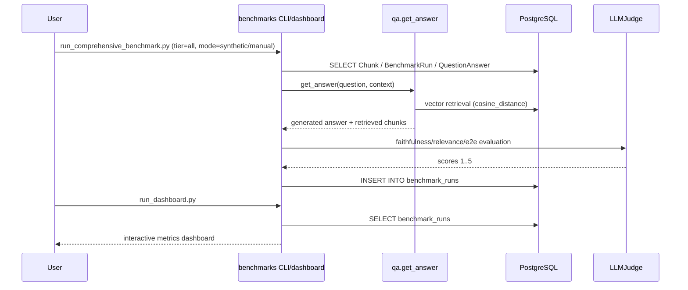

# Модуль для оценки качества RAG-системы Вопрошалыч

Enterprise-grade система бенчмарков для оценки Retrieval, Generation и End-to-End
качества RAG-пайплайна на реальных данных PostgreSQL и LLM-as-a-Judge.

## Обзор

Модуль `benchmarks` покрывает три рабочих сценария:
- **Synthetic dataset**: автоматически сгенерированный golden standard.
- **Manual dataset**: экспертная разметка для строгой валидации.
- **Real user data**: retrieval-метрики на реальных вопросах пользователей.

### Ключевые особенности

- ✅ **Single Source of Truth**: работа с реальной PostgreSQL базой
- ✅ **LLM-as-a-Judge**: оценка quality-метрик через judge-model
- ✅ **Три tier-уровня**: Retrieval, Generation, End-to-End
- ✅ **Manual + Real Users режимы**: отдельные пайплайны для академичной оценки
- ✅ **Версионированные артефакты**: JSON/Markdown отчёты + `benchmark_runs`

## Выбор режима работы

Модуль `benchmarks` поддерживает два режима работы:

| Режим | Когда использовать | Окружение | Документация |
|-------|-------------------|-------------|--------------|
| **Локальный** | Разработка, отладка, быстрые проверки | Локальный Python 3.12+ + PostgreSQL | [SMOKE_SCENARIO_LOCAL.md](SMOKE_SCENARIO_LOCAL.md) |
| **Контейнерный** | CI/CD, интеграционное тестирование, продакшн | Docker + Docker Compose | [SMOKE_SCENARIO_DOCKER.md](SMOKE_SCENARIO_DOCKER.md) |

---

## Локальный режим (без контейнеризации)

Локальный режим предназначен для разработки и отладки. Все команды выполняются напрямую через `uv run` на хостовой машине.

### Предварительные требования

- Python 3.12+
- Установленный UV: `curl -LsSf https://astral.sh/uv | sh`
- PostgreSQL доступен локально или по сети
- Переменные окружения в `.env` или `.env.docker`

### Быстрый старт (локальный)

```bash
cd Submodules/voproshalych/benchmarks

# Установка зависимостей
make install-local

# Подготовка БД
make load-dump-local

# Генерация эмбеддингов
make generate-embeddings-local

# Генерация датасета и запуск бенчмарков
make generate-dataset-local
make run-benchmarks-local

# Запуск дашборда
make run-dashboard-local
```

### Полный pipeline (локальный)

```bash
cd Submodules/voproshalych

# Установка зависимостей
uv sync

# Подготовка БД
uv run python benchmarks/load_database_dump.py --dump benchmarks/data/dump/virtassist_backup_20260213.dump

# Генерация эмбеддингов
uv run python benchmarks/generate_embeddings.py --chunks
uv run python benchmarks/generate_embeddings.py --check-coverage

# Генерация датасета
uv run python benchmarks/generate_dataset.py --max-questions 20

# Запуск бенчмарков
uv run python benchmarks/run_comprehensive_benchmark.py --tier all --mode synthetic --limit 10

# Запуск дашборда
uv run python benchmarks/run_dashboard.py
```

### Доступные команды Makefile (локальный)

```bash
cd Submodules/voproshalych/benchmarks
make help
```

| Команда | Описание |
|---------|----------|
| `install-local` | Установить зависимости через uv sync |
| `load-dump-local` | Загрузить дамп БД |
| `drop-tables-local` | Удалить таблицы БД |
| `generate-embeddings-local` | Сгенерировать эмбеддинги |
| `generate-dataset-local` | Сгенерировать датасет (20 вопросов) |
| `run-benchmarks-local` | Запустить бенчмарки (synthetic mode, 10 вопросов) |
| `run-dashboard-local` | Запустить дашборд локально |

👉 **Подробные инструкции**: [SMOKE_SCENARIO_LOCAL.md](SMOKE_SCENARIO_LOCAL.md)

---

## Контейнерный режим (docker-compose.benchmarks.yml)

Контейнерный режим предназначен для CI/CD, интеграционного тестирования и продакшна. Все команды выполняются внутри контейнеров Docker.

### Предварительные требования

- Docker и Docker Compose установлены
- `.env.docker` файл настроен с переменными окружения
- Доступен PostgreSQL в сети Docker

### Быстрый старт (Docker)

```bash
cd Submodules/voproshalych/benchmarks

# Поднять стек с бенчмарками
make COMPOSE_FILE=../docker-compose.benchmarks.yml up

# Подготовка БД
make COMPOSE_FILE=../docker-compose.benchmarks.yml load-dump

# Генерация эмбеддингов
make COMPOSE_FILE=../docker-compose.benchmarks.yml generate-embeddings

# Генерация датасета и запуск бенчмарков
make COMPOSE_FILE=../docker-compose.benchmarks.yml generate-dataset
make COMPOSE_FILE=../docker-compose.benchmarks.yml run-benchmarks

# Запуск дашборда
make COMPOSE_FILE=../docker-compose.benchmarks.yml run-dashboard

# Остановка
make COMPOSE_FILE=../docker-compose.benchmarks.yml down
```

### Полный pipeline (Docker)

```bash
cd Submodules/voproshalych

# Поднять стек
docker compose -f docker-compose.benchmarks.yml up -d --build

# Проверить статус
docker compose -f docker-compose.benchmarks.yml ps

# Подготовка БД
docker compose -f docker-compose.benchmarks.yml exec -T benchmarks uv run python benchmarks/load_database_dump.py \
  --dump benchmarks/data/dump/virtassist_backup_20260213.dump

# Генерация эмбеддингов
docker compose -f docker-compose.benchmarks.yml exec benchmarks uv run python benchmarks/generate_embeddings.py --chunks
docker compose -f docker-compose.benchmarks.yml exec benchmarks uv run python benchmarks/generate_embeddings.py --check-coverage

# Генерация датасета
docker compose -f docker-compose.benchmarks.yml exec benchmarks uv run python benchmarks/generate_dataset.py --max-questions 20

# Запуск бенчмарков
docker compose -f docker-compose.benchmarks.yml exec benchmarks uv run python benchmarks/run_comprehensive_benchmark.py \
  --tier all --mode synthetic --limit 10

# Запуск дашборда
docker compose -f docker-compose.benchmarks.yml run --rm -p 7860:7860 benchmarks uv run python benchmarks/run_dashboard.py

# Остановка
docker compose -f docker-compose.benchmarks.yml down
```

### Доступные команды Makefile (Docker)

```bash
cd Submodules/voproshalych/benchmarks
make help
```

| Команда | Описание |
|---------|----------|
| `up` | Поднять все сервисы (использует COMPOSE_FILE) |
| `down` | Остановить все сервисы (использует COMPOSE_FILE) |
| `load-dump` | Загрузить дамп БД через Docker |
| `drop-tables` | Удалить таблицы БД через Docker |
| `generate-embeddings` | Сгенерировать эмбеддинги через Docker |
| `generate-dataset` | Сгенерировать датасет через Docker (500 вопросов) |
| `run-benchmarks` | Запустить бенчмарки через Docker |
| `run-dashboard` | Запустить дашборд через Docker |
| `ps` | Показать статус сервисов |
| `logs` | Показать логи сервиса benchmarks |

👉 **Подробные инструкции**: [SMOKE_SCENARIO_DOCKER.md](SMOKE_SCENARIO_DOCKER.md)

---

## Структура проекта

```
benchmarks/
├── data/
│   ├── dataset_YYYYMMDD_HHMMSS.json
│   ├── manual_dataset_YYYYMMDD_HHMMSS.json
│   ├── dataset_errors_YYYYMMDD_HHMMSS.json
│   └── dump/
│       └── virtassist_backup_20260213.dump
├── docs/
│   └── manual_annotation_guide.md
├── models/
│   ├── rag_benchmark.py
│   └── real_queries_benchmark.py
├── reports/
│   ├── rag_benchmark_*.json
│   └── rag_benchmark_*.md
├── utils/
│   ├── llm_judge.py
│   ├── evaluator.py
│   └── embedding_generator.py
├── Makefile
├── Dockerfile
├── generate_embeddings.py
├── generate_dataset.py
├── load_database_dump.py
├── run_comprehensive_benchmark.py
└── run_dashboard.py
```

## Компоненты системы

### 1) LLM-судья (`utils/llm_judge.py`)

- `generate_question_from_chunk()` — генерация вопроса и ground truth ответа
- `evaluate_faithfulness()` — оценка фактичности (1..5)
- `evaluate_answer_relevance()` — оценка релевантности (1..5)
- `evaluate_e2e_quality()` — итоговая оценка ответа (1..5)

### 2) Генерация эмбеддингов (`generate_embeddings.py`)

Генерирует эмбеддинги для `QuestionAnswer` и `Chunk`.

### 3) Генерация synthetic dataset (`generate_dataset.py`)

Новая стратегия генерации:
- попытка генерации для **каждого чанка** с эмбеддингом и непустым текстом;
- стратегия **1 чанк -> 1 вопрос** до достижения `--max-questions`;
- retry на уровне скрипта + retry в `LLMJudge`;
- отдельный отчёт `dataset_errors_*.json` с причинами ошибок;
- поддержка инкрементального дополнения через `--skip-existing-dataset`.

### 4) Комплексный раннер (`run_comprehensive_benchmark.py`)

Поддерживаемые режимы:
- `--mode synthetic` (по умолчанию)
- `--mode manual`
- `--mode real-users`

## Три уровня тестирования

### Tier 1: Retrieval Accuracy

**Процедура:**
1. Для каждого вопроса рассчитывается эмбеддинг запроса.
2. Выполняется vector search по `Chunk.embedding.cosine_distance(...)`.
3. Рассчитываются hit-rate и классические IR-метрики.

В коде: `benchmarks/models/rag_benchmark.py`, `benchmarks/utils/evaluator.py`.

**Метрики:** `HitRate@K`, `Recall@K`, `Precision@K`, `MRR`, `NDCG@K`.

$$
\mathrm{HitRate@K} = \frac{1}{|Q|} \sum_{q \in Q} \mathbf{1}[\exists d \in \mathrm{TopK}(q): d \in G_q]
$$

$$
\mathrm{Recall@K} = \frac{1}{|Q|} \sum_{q \in Q} \frac{|\mathrm{TopK}(q) \cap G_q|}{|G_q|}
$$

$$
\mathrm{Precision@K} = \frac{1}{|Q|} \sum_{q \in Q} \frac{|\mathrm{TopK}(q) \cap G_q|}{K}
$$

$$
\mathrm{MRR} = \frac{1}{|Q|} \sum_{q \in Q} \frac{1}{\mathrm{rank}_q}
$$

$$
\mathrm{NDCG@K} = \frac{1}{|Q|} \sum_{q \in Q} \frac{\mathrm{DCG@K}(q)}{\mathrm{IDCG@K}(q)}
$$

### Tier 2: Generation Quality

**Процедура:**
1. Для вопроса собирается релевантный контекст (по `chunk_text`,
   `relevant_chunk_ids`, `chunk_id` или `relevant_urls`).
2. Генерируется ответ через реальный pipeline `qa.main.get_answer`.
3. LLM Judge оценивает фактичность и релевантность.

**Метрики:** `avg_faithfulness`, `avg_answer_relevance`.

$$
\mathrm{avg\_faithfulness} = \frac{1}{N} \sum_{i=1}^{N} s_i,
\quad s_i \in \{1,2,3,4,5\}
$$

$$
\mathrm{avg\_answer\_relevance} = \frac{1}{N} \sum_{i=1}^{N} s_i,
\quad s_i \in \{1,2,3,4,5\}
$$

Шкала 1..5 трактуется как **ordinal scale** (упорядоченная, не строго линейная).

### Tier 3: End-to-End

**Процедура:**
1. Выполняется retrieval top-1 для вопроса.
2. Генерируется финальный ответ на retrieved контексте.
3. Judge оценивает `E2E score` относительно `ground_truth_answer`.
4. Считается косинусная близость эмбеддингов системного и эталонного ответа.

**Метрики:** `avg_e2e_score`, `avg_semantic_similarity`.

$$
\mathrm{avg\_e2e\_score} = \frac{1}{N} \sum_{i=1}^{N} s_i,
\quad s_i \in \{1,2,3,4,5\}
$$

$$
\cos\_sim(u, v) = \frac{u \cdot v}{\|u\|\,\|v\|}
$$

## CLI команды

### `load_database_dump.py`

**Локальный режим:**
```bash
cd Submodules/voproshalych
uv run python benchmarks/load_database_dump.py --dump benchmarks/data/dump/virtassist_backup_20260213.dump
uv run python benchmarks/load_database_dump.py --dump-dir benchmarks/data/dump
uv run python benchmarks/load_database_dump.py --drop-tables-only
```

**Docker режим:**
```bash
cd Submodules/voproshalych
docker compose -f docker-compose.benchmarks.yml exec -T benchmarks uv run python benchmarks/load_database_dump.py \
  --dump benchmarks/data/dump/virtassist_backup_20260213.dump
docker compose -f docker-compose.benchmarks.yml exec -T benchmarks uv run python benchmarks/load_database_dump.py \
  --drop-tables-only
```

**Важно:** При загрузке дампа таблицы автоматически очищаются перед загрузкой. Флаг `--drop-tables-only` используется для удаления таблиц без загрузки дампа.

### `generate_embeddings.py`

**Локальный режим:**
```bash
cd Submodules/voproshalych
uv run python benchmarks/generate_embeddings.py --chunks
uv run python benchmarks/generate_embeddings.py --all
uv run python benchmarks/generate_embeddings.py --score 5
uv run python benchmarks/generate_embeddings.py --check-coverage
```

**Docker режим:**
```bash
cd Submodules/voproshalych
docker compose -f docker-compose.benchmarks.yml exec benchmarks uv run python benchmarks/generate_embeddings.py --chunks
docker compose -f docker-compose.benchmarks.yml exec benchmarks uv run python benchmarks/generate_embeddings.py --all
docker compose -f docker-compose.benchmarks.yml exec benchmarks uv run python benchmarks/generate_embeddings.py --score 5
docker compose -f docker-compose.benchmarks.yml exec benchmarks uv run python benchmarks/generate_embeddings.py --check-coverage
```

### `generate_dataset.py`

**Локальный режим:**
```bash
cd Submodules/voproshalych
uv run python benchmarks/generate_dataset.py --max-questions 20
uv run python benchmarks/generate_dataset.py --max-questions 300 --output benchmarks/data/dataset_custom.json
uv run python benchmarks/generate_dataset.py --max-questions 500 --skip-existing-dataset benchmarks/data/dataset_20260216_124845.json
uv run python benchmarks/generate_dataset.py --check-only --output benchmarks/data/dataset_custom.json
```

**Docker режим:**
```bash
cd Submodules/voproshalych
docker compose -f docker-compose.benchmarks.yml exec benchmarks uv run python benchmarks/generate_dataset.py --max-questions 500
docker compose -f docker-compose.benchmarks.yml exec benchmarks uv run python benchmarks/generate_dataset.py --max-questions 300 --output benchmarks/data/dataset_custom.json
docker compose -f docker-compose.benchmarks.yml exec benchmarks uv run python benchmarks/generate_dataset.py --max-questions 500 --skip-existing-dataset benchmarks/data/dataset_20260216_124845.json
docker compose -f docker-compose.benchmarks.yml exec benchmarks uv run python benchmarks/generate_dataset.py --check-only --output benchmarks/data/dataset_custom.json
```

### `run_comprehensive_benchmark.py`

**Локальный режим:**
```bash
cd Submodules/voproshalych
uv run python benchmarks/run_comprehensive_benchmark.py --tier all --mode synthetic --dataset benchmarks/data/dataset_20260216_124845.json
uv run python benchmarks/run_comprehensive_benchmark.py --tier all --mode manual --manual-dataset benchmarks/data/manual_dataset_20260217_101500.json
uv run python benchmarks/run_comprehensive_benchmark.py --mode real-users --real-score 5 --real-limit 500 --top-k 10
```

**Docker режим:**
```bash
cd Submodules/voproshalych
docker compose -f docker-compose.benchmarks.yml exec benchmarks uv run python benchmarks/run_comprehensive_benchmark.py \
  --tier all --mode synthetic --dataset benchmarks/data/dataset_20260216_124845.json
docker compose -f docker-compose.benchmarks.yml exec benchmarks uv run python benchmarks/run_comprehensive_benchmark.py \
  --tier all --mode manual --manual-dataset benchmarks/data/manual_dataset_20260217_101500.json
docker compose -f docker-compose.benchmarks.yml exec benchmarks uv run python benchmarks/run_comprehensive_benchmark.py \
  --mode real-users --real-score 5 --real-limit 500 --top-k 10
```

### `run_dashboard.py`

**Локальный режим:**
```bash
cd Submodules/voproshalych
uv run python benchmarks/run_dashboard.py
```

**Docker режим:**
```bash
cd Submodules/voproshalych
docker compose -f docker-compose.benchmarks.yml run --rm -p 7860:7860 benchmarks uv run python benchmarks/run_dashboard.py
```

Дашборд доступен по адресу: `http://localhost:7860`

## Запуск с docker-compose.benchmarks.yml

Для работы с бенчмарками используется отдельный docker-compose файл `docker-compose.benchmarks.yml`.

### Описание

Этот файл включает в себя:
- Все сервисы основного приложения (db, db-migrate, qa, chatbot, adminpanel, max)
- Дополнительный сервис `benchmarks` с портом 7860 для дашборда
- Отдельные volumes для reports, data и cache бенчмарков

### Преимущества

- **Изолированный стек**: Полная среда для тестирования бенчмарков
- **Отдельные volumes**: Данные бенчмарков хранятся отдельно от данных приложения
- **Управление зависимостями**: Сервис benchmarks использует UV для управления зависимостями
- **Единая точка запуска**: Все сервисы поднимаются одной командой

### Быстрый старт

```bash
# Поднять стек с бенчмарками
cd Submodules/voproshalych
docker compose -f docker-compose.benchmarks.yml up -d --build

# Остановить
docker compose -f docker-compose.benchmarks.yml down
```

👉 **Подробные инструкции**: [SMOKE_SCENARIO_DOCKER.md](SMOKE_SCENARIO_DOCKER.md)

## Архитектура



## Полезные ссылки

- `benchmarks/docs/manual_annotation_guide.md`
- `benchmarks/dashboard.py`
- `benchmarks/run_comprehensive_benchmark.py`
