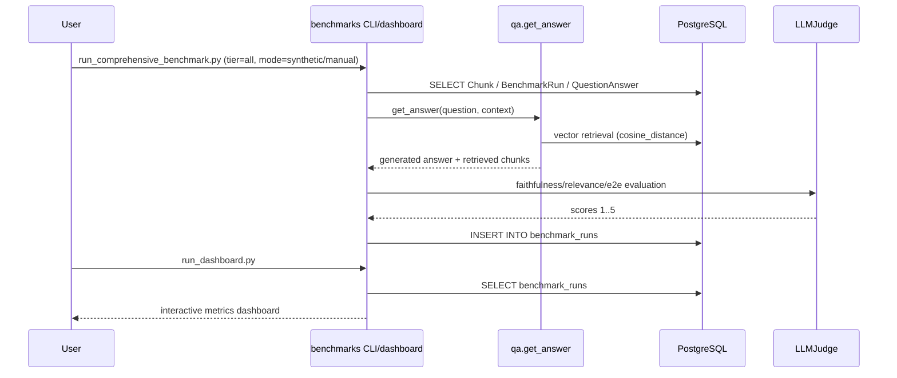

# Модуль для оценки качества RAG-системы Вопрошалыч

Enterprise-grade система бенчмарков для оценки Retrieval, Generation и End-to-End
качества RAG-пайплайна на реальных данных PostgreSQL и LLM-as-a-Judge.

## Обзор

Модуль `benchmarks` покрывает три рабочих сценария:
- **Synthetic dataset**: автоматически сгенерированный golden standard.
- **Manual dataset**: экспертная разметка для строгой валидации.
- **Real user data**: retrieval-метрики на реальных вопросах пользователей.

### Ключевые особенности

- ✅ **Single Source of Truth**: работа с реальной PostgreSQL базой
- ✅ **LLM-as-a-Judge**: оценка quality-метрик через judge-model
- ✅ **Три tier-уровня**: Retrieval, Generation, End-to-End
- ✅ **Manual + Real Users режимы**: отдельные пайплайны для академичной оценки
- ✅ **Версионированные артефакты**: JSON/Markdown отчёты + `benchmark_runs`

## Структура проекта

```
benchmarks/
├── data/
│   ├── dataset_YYYYMMDD_HHMMSS.json
│   ├── manual_dataset_YYYYMMDD_HHMMSS.json
│   └── dataset_errors_YYYYMMDD_HHMMSS.json
├── docs/
│   └── manual_annotation_guide.md
├── models/
│   ├── rag_benchmark.py
│   └── real_queries_benchmark.py
├── reports/
│   ├── rag_benchmark_*.json
│   └── rag_benchmark_*.md
├── utils/
│   ├── llm_judge.py
│   ├── evaluator.py
│   └── embedding_generator.py
├── Makefile
├── dashboard.py
├── generate_embeddings.py
├── generate_dataset.py
├── load_database_dump.py
├── run_comprehensive_benchmark.py
└── run_dashboard.py
```

## Компоненты системы

### 1) LLM-судья (`utils/llm_judge.py`)

- `generate_question_from_chunk()` — генерация вопроса и ground truth ответа
- `evaluate_faithfulness()` — оценка фактичности (1..5)
- `evaluate_answer_relevance()` — оценка релевантности (1..5)
- `evaluate_e2e_quality()` — итоговая оценка ответа (1..5)

### 2) Генерация эмбеддингов (`generate_embeddings.py`)

Генерирует эмбеддинги для `QuestionAnswer` и `Chunk`.

### 3) Генерация synthetic dataset (`generate_dataset.py`)

Новая стратегия генерации:
- попытка генерации для **каждого чанка** с эмбеддингом и непустым текстом;
- стратегия **1 чанк -> 1 вопрос** до достижения `--max-questions`;
- retry на уровне скрипта + retry в `LLMJudge`;
- отдельный отчёт `dataset_errors_*.json` с причинами ошибок;
- поддержка инкрементального дополнения через `--skip-existing-dataset`.

### 4) Комплексный раннер (`run_comprehensive_benchmark.py`)

Поддерживаемые режимы:
- `--mode synthetic` (по умолчанию)
- `--mode manual`
- `--mode real-users`

## Три уровня тестирования

### Tier 1: Retrieval Accuracy

**Процедура:**
1. Для каждого вопроса рассчитывается эмбеддинг запроса.
2. Выполняется vector search по `Chunk.embedding.cosine_distance(...)`.
3. Рассчитываются hit-rate и классические IR-метрики.

В коде: `benchmarks/models/rag_benchmark.py`, `benchmarks/utils/evaluator.py`.

**Метрики:** `HitRate@K`, `Recall@K`, `Precision@K`, `MRR`, `NDCG@K`.

$$
\mathrm{HitRate@K} = \frac{1}{|Q|} \sum_{q \in Q} \mathbf{1}[\exists d \in \mathrm{TopK}(q): d \in G_q]
$$

$$
\mathrm{Recall@K} = \frac{1}{|Q|} \sum_{q \in Q} \frac{|\mathrm{TopK}(q) \cap G_q|}{|G_q|}
$$

$$
\mathrm{Precision@K} = \frac{1}{|Q|} \sum_{q \in Q} \frac{|\mathrm{TopK}(q) \cap G_q|}{K}
$$

$$
\mathrm{MRR} = \frac{1}{|Q|} \sum_{q \in Q} \frac{1}{\mathrm{rank}_q}
$$

$$
\mathrm{NDCG@K} = \frac{1}{|Q|} \sum_{q \in Q} \frac{\mathrm{DCG@K}(q)}{\mathrm{IDCG@K}(q)}
$$

### Tier 2: Generation Quality

**Процедура:**
1. Для вопроса собирается релевантный контекст (по `chunk_text`,
   `relevant_chunk_ids`, `chunk_id` или `relevant_urls`).
2. Генерируется ответ через реальный pipeline `qa.main.get_answer`.
3. LLM Judge оценивает фактичность и релевантность.

**Метрики:** `avg_faithfulness`, `avg_answer_relevance`.

$$
\mathrm{avg\_faithfulness} = \frac{1}{N} \sum_{i=1}^{N} s_i,
\quad s_i \in \{1,2,3,4,5\}
$$

$$
\mathrm{avg\_answer\_relevance} = \frac{1}{N} \sum_{i=1}^{N} s_i,
\quad s_i \in \{1,2,3,4,5\}
$$

Шкала 1..5 трактуется как **ordinal scale** (упорядоченная, не строго линейная).

### Tier 3: End-to-End

**Процедура:**
1. Выполняется retrieval top-1 для вопроса.
2. Генерируется финальный ответ на retrieved контексте.
3. Judge оценивает `E2E score` относительно `ground_truth_answer`.
4. Считается косинусная близость эмбеддингов системного и эталонного ответа.

**Метрики:** `avg_e2e_score`, `avg_semantic_similarity`.

$$
\mathrm{avg\_e2e\_score} = \frac{1}{N} \sum_{i=1}^{N} s_i,
\quad s_i \in \{1,2,3,4,5\}
$$

$$
\mathrm{cos\_sim}(u, v) = \frac{u \cdot v}{\|u\|\,\|v\|}
$$

## CLI команды

### `load_database_dump.py`

```bash
docker compose exec qa python benchmarks/load_database_dump.py --dump benchmarks/data/dump/virtassist_backup_20260213.dump
docker compose exec qa python benchmarks/load_database_dump.py --dump-dir benchmarks/data/dump --drop-tables
```

`--drop-tables` используйте для полной пересборки benchmark-среды в БД.

### `generate_embeddings.py`

```bash
docker compose exec qa python benchmarks/generate_embeddings.py --chunks
docker compose exec qa python benchmarks/generate_embeddings.py --all
docker compose exec qa python benchmarks/generate_embeddings.py --score 5
docker compose exec qa python benchmarks/generate_embeddings.py --check-coverage
```

### `generate_dataset.py`

```bash
docker compose exec qa python benchmarks/generate_dataset.py --max-questions 500
docker compose exec qa python benchmarks/generate_dataset.py --max-questions 300 --output benchmarks/data/dataset_custom.json
docker compose exec qa python benchmarks/generate_dataset.py --max-questions 500 --skip-existing-dataset benchmarks/data/dataset_20260216_124845.json
docker compose exec qa python benchmarks/generate_dataset.py --check-only --output benchmarks/data/dataset_custom.json
```

### `run_comprehensive_benchmark.py`

```bash
docker compose exec qa python benchmarks/run_comprehensive_benchmark.py --tier all --mode synthetic --dataset benchmarks/data/dataset_20260216_124845.json
docker compose exec qa python benchmarks/run_comprehensive_benchmark.py --tier all --mode manual --manual-dataset benchmarks/data/manual_dataset_20260217_101500.json
docker compose exec qa python benchmarks/run_comprehensive_benchmark.py --mode real-users --real-score 5 --real-limit 500 --top-k 10
```

### `run_dashboard.py`

```bash
docker compose exec qa python benchmarks/run_dashboard.py
```

## Полный рабочий цикл

### Шаг 0. Поднять контейнеры

```bash
cd Submodules/voproshalych
docker compose up -d --build
```

Дождитесь здорового состояния всех сервисов:
```bash
docker compose ps
```

### Шаг 1. Подготовка `.env.docker`

Если `.env.docker` не существует:

```bash
cd Submodules/voproshalych
cp .env.docker.example .env.docker
```

Заполните как минимум:
- `MISTRAL_API`, `MISTRAL_MODEL`
- `BENCHMARKS_JUDGE_API_KEY` (или `JUDGE_API`)
- `EMBEDDING_MODEL_PATH`

### Шаг 2. Подготовка БД для бенчмарков

```bash
cd Submodules/voproshalych
docker compose exec qa python benchmarks/load_database_dump.py --dump benchmarks/data/dump/virtassist_backup_20260213.dump
```

Если нужно полностью переинициализировать таблицы перед загрузкой:

```bash
docker compose exec qa python benchmarks/load_database_dump.py --dump-dir benchmarks/data/dump --drop-tables
```

### Шаг 3. Генерация эмбеддингов

```bash
cd Submodules/voproshalych
docker compose exec qa python benchmarks/generate_embeddings.py --chunks
docker compose exec qa python benchmarks/generate_embeddings.py --check-coverage
```

### Шаг 4. Генерация synthetic датасета

```bash
cd Submodules/voproshalych
docker compose exec qa python benchmarks/generate_dataset.py --max-questions 500
```

### Шаг 5. (Опционально) подготовка manual dataset

- Создайте файл `benchmarks/data/manual_dataset_YYYYMMDD_HHMMSS.json`
- Следуйте: `benchmarks/docs/manual_annotation_guide.md`

### Шаг 6. Запуск бенчмарков

```bash
cd Submodules/voproshalych
docker compose exec qa python benchmarks/run_comprehensive_benchmark.py --tier all --mode synthetic --dataset benchmarks/data/dataset_YYYYMMDD_HHMMSS.json
docker compose exec qa python benchmarks/run_comprehensive_benchmark.py --tier all --mode manual --manual-dataset benchmarks/data/manual_dataset_YYYYMMDD_HHMMSS.json
docker compose exec qa python benchmarks/run_comprehensive_benchmark.py --mode real-users --real-score 5 --real-limit 500
```

### Шаг 7. Просмотр отчётов и дашборда

```bash
cd Submodules/voproshalych
docker compose exec qa python benchmarks/run_dashboard.py
```

Дашборд доступен по адресу: `http://localhost:7860`

## Быстрые шорткаты (Makefile)

Из `Submodules/voproshalych/benchmarks` внутри контейнера:

```bash
docker compose exec qa make -C benchmarks load-dump
docker compose exec qa make -C benchmarks generate-embeddings
docker compose exec qa make -C benchmarks generate-dataset
docker compose exec qa make -C benchmarks run-benchmarks
docker compose exec qa make -C benchmarks run-dashboard
```

## Архитектура



## Docker-compose пример для отдельного benchmark-сервиса

```yaml
services:
  benchmarks:
    build:
      context: .
      dockerfile: Dockerfile
    command: python benchmarks/run_dashboard.py
    env_file:
      - .env.docker
    ports:
      - "7860:7860"
    depends_on:
      - db
```

Сервис предназначен для ручного запуска бенчмарков и дашборда по запросу.

## Полезные ссылки

- `benchmarks/docs/manual_annotation_guide.md`
- `benchmarks/dashboard.py`
- `benchmarks/run_comprehensive_benchmark.py`
