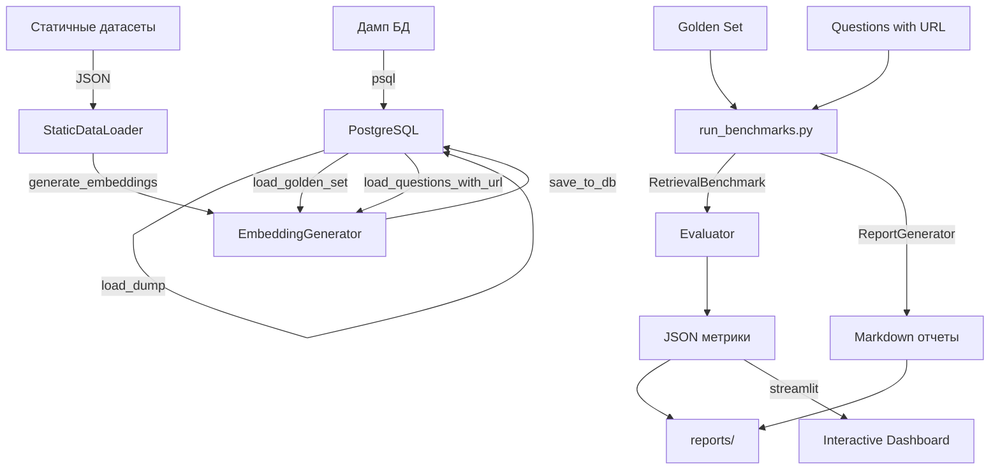

# Архитектурный аудит: Система бенчарков Вопрошалыча

## Дата
2026-02-13

## Обзор архитектуры

Система бенчарков предназначена для оценки качества RAG-системы Вопрошалыча.

## Текущая реализация

### Компоненты

```
benchmarks/
├── models/
│   └── retrieval_benchmark.py    # Бенчмарки поиска (Tier 1, Tier 2)
├── utils/
│   ├── evaluator.py              # Вычисление метрик (Recall, Precision, MRR, NDCG)
│   ├── data_loader.py             # Загрузка данных из БД (УСТАРЕЛО)
│   ├── static_data_loader.py      # Загрузка статичных датасетов (НОВОЕ)
│   ├── database_dump_loader.py     # Загрузка дампа БД
│   ├── embedding_generator.py      # Генерация эмбеддингов
│   └── report_generator.py         # Генерация отчётов
├── generate_embeddings.py            # CLI: генерация эмбеддингов
├── run_benchmarks.py               # CLI: запуск бенчарков
├── load_database_dump.py          # CLI: загрузка дампа БД
└── dashboard.py                   # Интерактивный дашборд (Streamlit)
```

### Потоки данных



## Метрики

### Tier 1: Поиск похожих вопросов (question_answer)

| Метрика | Описание | Целевое значение |
|---------|----------|------------------|
| Recall@1 | Доля релевантных на первой позиции | ≥ 0.8 |
| Recall@5 | Доля релевантных в топ-5 | ≥ 0.9 |
| MRR | Обратный ранг первого релевантного | ≥ 0.8 |
| Precision@5 | Точность в топ-5 | ≥ 0.8 |
| NDCG@10 | Нормализованный DCG@10 | ≥ 0.8 |

### Tier 2: Поиск чанков (chunk)

| Метрика | Описание | Целевое значение |
|---------|----------|------------------|
| Recall@1 | Доля релевантных на первой позиции | ≥ 0.5 |
| Recall@10 | Доля релевантных в топ-10 | ≥ 0.7 |
| MRR | Обратный ранг первого релевантного | ≥ 0.5 |
| Precision@5 | Точность в топ-5 | ≥ 0.5 |
| NDCG@10 | Нормализованный DCG@10 | ≥ 0.6 |

## Датасеты

### Статичные (benchmarks/data/static/)
- `03_golden_set_score_5.json.txt` - Золотой набор (score=5)
- `04_low_quality_score_1.json.txt` - Низкое качество (score=1)
- `05_questions_with_url.json.txt` - Вопросы с URL
- `10_recent_questions_with_url_last_6_months.json.txt` - Последние 6 месяцев

### Динамические (из БД)
- `question_answer` - Все вопросы из БД
- `chunk` - Все чанки из БД

## Ограничения

### Текущие
1. **Покрытие эмбеддингами**
   - Текущее: 4.78% (251/5247 вопросов)
   - Проблема: большинство вопросов не имеют эмбеддингов
   - Влияние: бенчмарки работают только с частью данных

2. **Зависимость от БД**
   - При пустой БД метрики не считаются
   - Нужна загрузка дампа (9.8 МБ)

3. **Производительность**
   - Генерация эмбеддингов ~30 секунд/100 вопросов
   - Бенчмарк Tier 1 с 278 вопросами: ~45 секунд
   - Бенчмарк Tier 2 с 278 вопросами: ~55 секунд

### Потенциальные
1. **Версионирование архитектуры**
   - Нет контроля изменений в структуре бенчарков
   - Сложно отслеживать рефакторинги

2. **Масштабируемость**
   - Статичные датасеты не обновляются автоматически
   - Нет A/B тестирования разных конфигураций

3. **Интерактивность**
   - Дашборд (dashboard.py) не интегрирован с CLI
   - Нет веб-интерфейса для сравнения запусков

## Проблемы и решения

### Проблема 1: Плохое покрытие эмбеддингами

**Причина:**
- Эмбеддинги генерируются только для вопросов с оценками
- Большинство вопросов из продакшена не имеют оценок
- Нет процесса периодической генерации эмбеддингов

**Решения:**
- Запланировать генерацию эмбеддингов для всех вопросов
- Автоматизировать генерацию при новых вопросах
- Увеличить покрытие до минимум 80%

### Проблема 2: Разные результаты Tier 1 и Tier 2

**Наблюдения:**
- Tier 1 (поиск по вопросам): MRR=0.8561 ✅
- Tier 2 (поиск по чанкам): MRR=0.5937 ⚠️

**Причина:**
- Вопросы лучше описывают суть запроса
- Чанки - это фрагменты, теряющие контекст
- Эмбеддинги вопросов более качественные (скорее создаются)

**Решения:**
- Улучшить чанковедение (большие, перекрывающиеся)
- Добавить метаданные к чанкам (заголовок, автор)
- Рассмотреть векторные базы данных (Qdrant, Milvus)

### Проблема 3: Отсутствие версионирования архитектуры

**Причина:**
- Нет стандартизированного подхода к хранению версий
- Сложно отслеживать изменения
- Нет документирования истории изменений

**Решение:**
- Создать директорию `architecture_snapshots/`
- Хранить версии архитектуры с датой и описанием изменений
- Использовать семантическое именование файлов

## Рекомендации по улучшению

### Краткосрочные (1-2 недели)

1. **Увеличить покрытие эмбеддингами**
   - Сгенерировать эмбеддинги для всех 5000+ вопросов
   - Целевое покрытие: 80%

2. **Улучшить чанковедение**
   - Увеличить размер чанков (сейчас ~500 символов)
   - Добавить перекрытие между чанками (128 символов)
   - Добавить контекст (заголовок документа)

3. **Добавить больше метрик**
   - MAP (Mean Average Precision)
   - F1-Score
   - Время выполнения

### Среднесрочные (1-2 месяца)

1. **Векторная база данных**
   - Перейти на Qdrant или Milvus
   - Ускорить поиск в 10-100 раз
   - Поддержать фильтрацию и пейджинг

2. **A/B тестирование**
   - Поддержка разных моделей эмбеддингов
   - Сравнение конфигураций чанковедения
   - Автоматический запуск экспериментов

3. **Интерактивный дашборд**
   - Интеграция Streamlit с CLI
   - Визуализация истории запусков
   - Сравнение результатов по датам

### Долгосрочные (3-6 месяцев)

1. **CI/CD интеграция**
   - Автоматический запуск бенчарков
   - Отслеживание деградации метрик
   - Алерты при падении качества

2. **Многоуровневые бенчмарки**
   - Оценка QA-системы (точность ответов)
   - Оценка RAG-системы (качество поиска)
   - Комплексная оценка всей системы

3. **Производительность**
   - Батчовая генерация эмбеддингов
   - Кэширование эмбеддингов
   - Асинхронная обработка

## Технический долг

### Текущий долг: изоляция файлов

Необходимые действия:
1. Переместить `pyproject.toml` в `benchmarks/`
2. Переместить `main.py` в `benchmarks/`
3. Добавить `benchmarks/.venv/` в `.gitignore`
4. Добавить `benchmarks/.pytest_cache/` в `.gitignore`

См. анализ: `/Users/masha/src/github.com/webmasha/voproshalych-personal/2026_benchmarks/01_Изоляция_проектных_файлов_в_директорию_бенчарков.md`

### Будущий долг: рефакторинг

1. Разделение логики Tier 1 и Tier 2
2. Добавление абстракций для разных стратегий поиска
3. Улучшение тестируемости кода

## Заключение

Система бенчарков полностью функциональна и предоставляет:
- ✅ Генерацию эмбеддингов
- ✅ Бенчмарки Tier 1 и Tier 2
- ✅ Вычисление всех необходимых метрик
- ✅ Генерацию отчётов
- ✅ Интерактивный дашборд

Текущие результаты:
- ✅ Tier 1: отличное качество (MRR=0.8561)
- ⚠️ Tier 2: среднее качество (MRR=0.5937)
- ⚠️ Покрытие эмбеддингами: 4.78% (недостаточно)

Приоритеты:
1. 🎯 Увеличить покрытие эмбеддингами до 80%
2. 🎯 Улучшить чанковедение
3. 🎯 Добавить больше метрик
4. 🎯 Рассмотреть векторную БД
