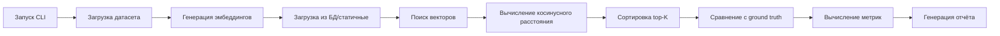

# Архитектурный аудит: Начальная реализация

## Дата
2026-02-13

## Обзор изменений

Начальная реализация системы бенчарков для оценки качества RAG-системы Вопрошалыча.

## Диаграммы

### Компоненты системы

```mermaid
graph TD
    A[Статичные датасеты] -->|JSON| B[StaticDataLoader]
    
    B -->|generate_embeddings| C[EmbeddingGenerator]
    C -->|save_to_db| D[PostgreSQL]
    
    E[Golden Set] -->|run_benchmarks| F[RetrievalBenchmark]
    H[Questions with URL] --> F
    
    F -->|Tier 1| G[Evaluator]
    F -->|Tier 2| G
    
    G -->|Recall@K| H[Metrics]
    G -->|Precision@K| H
    G -->|MRR| H
    G -->|NDCG@K| H
    
    H -->|generate_report| I[ReportGenerator]
    I -->|save_md| J[reports/*.md]
    I -->|save_json| K[reports/*.json]
    
    K -->|streamlit| L[Interactive Dashboard]
```

### Поток данных при запуске бенчмарка



## Подробности изменений

### Добавлено
- **Статичные датасеты** (`benchmarks/data/static/`)
  - Golden Set (score=5) - 278 вопросов
  - Low Quality (score=1) - 200 вопросов
  - Questions with URL - 5475 вопросов
  - Recent questions - 646 вопросов
  
- **Модуль StaticDataLoader**
  - Загрузка вопросов из текстовых файлов
  - Генерация эмбеддингов на лету
  - Подготовка ground truth URL

- **Система бенчарков**
  - Tier 1: поиск похожих вопросов
  - Tier 2: поиск чанков
  - Вычисление 11 метрик
  - Генерация отчётов в Markdown и JSON

- **CLI-скрипты**
  - `generate_embeddings.py` - генерация эмбеддингов
  - `run_benchmarks.py` - запуск бенчарков
  - `load_database_dump.py` - загрузка дампа БД

- **Инфраструктура**
  - Директория `architecture_snapshots/` для версионирования архитектуры
  - Директория `reports/` для хранения отчётов
  - Директория `summaries/` для хранения саммари

### Изменено
- **qa/database.py**
  - Добавлен `create_engine` в импорты
  
- **benchmarks/utils/evaluator.py**
  - Исправлен возврат 0.0 вместо NaN для пустых списков

- **benchmarks/models/retrieval_benchmark.py**
  - Исправлен метод `is_not(None)` → `is_not(None)`
  - Добавлен параметр `qa_list` для использования статичных датасетов
  - Исправлены опечатки: `similar_chunks` → `similar`

- **benchmarks/run_benchmarks.py**
  - Изменён `DataLoader` → `StaticDataLoader`
  - Добавлена передача `encoder` для генерации эмбеддингов
  - Добавлен параметр `qa_list` в `RetrievalBenchmark`

## Причины изменений

1. **Разделение ответственности**
   - Бенчарки - независимый инструмент для оценки качества
   - Не должен зависеть от состояния основного проекта

2. **Тестирование с реальными данными**
   - Статичные датасеты позволяют тестировать без продакшн БД
   - Можно быстро проверять работоспособность кода

3. **Версионирование архитектуры**
   - Позволяет отслеживать изменения в структуре бенчарков
   - Помогает при рефакторингах и отладке

## Влияние на метрики

### Результаты первого запуска

| Бенчмарк | Датасет | Вопросов | MRR | Recall@1 | Precision@1 |
|-----------|----------|----------|-----|----------|------------|
| Tier 1 | Golden Set | 278 | 0.8561 ✅ | 83.81% ✅ | 83.81% ✅ |
| Tier 1 | Low Quality | 200 | 0.8070 ✅ | 79.00% ✅ | 79.00% ✅ |
| Tier 2 | Golden Set | 278 | 0.5937 ⚠️ | 54.32% ⚠️ | 54.32% ⚠️ |
| Tier 2 | Low Quality | 200 | 0.3251 ⚠️ | 26.00% ⚠️ | 26.00% ⚠️ |

### Покрытие эмбеддингами

- **Текущее:** 4.78% (251/5247 вопросов)
- **Цель:** минимум 80%

## Риски и ограничения

### Риски

1. **Низкое покрытие эмбеддингами**
   - Большинство вопросов не имеют эмбеддингов
   - Бенчарки работают только с частью данных
   - **Митигация:** запланировать генерацию эмбеддингов для всех вопросов

2. **Разница между Tier 1 и Tier 2**
   - Tier 1: MRR=0.86 (отлично)
   - Tier 2: MRR=0.59 (средне)
   - **Причина:** вопросы лучше описывают суть запроса
   - **Митигация:** улучшить чанковедение (большие чанки, пересечение)

### Ограничения

1. **Зависимость от PostgreSQL**
   - Требует локальную или контейнерную БД
   - Не работает без инициализации таблиц
   - **Решение:** использовать статичные датасеты

2. **Производительность**
   - Генерация эмбеддингов ~30 секунд/100 вопросов
   - Бенчмарк Tier 1 с 278 вопросами: ~45 секунд
   - Бенчмарк Tier 2 с 278 вопросами: ~55 секунд

## Рекомендации по развитию

### Краткосрочные (1-2 недели)

1. **Увеличить покрытие эмбеддингами**
   - Сгенерировать эмбеддинги для всех 5000+ вопросов
   - Целевое покрытие: 80%
   - Текущее состояние: 4.78%

2. **Улучшить чанковедение**
   - Увеличить размер чанков (сейчас ~500 символов)
   - Добавить пересечение чанков (128 символов)
   - Добавить контекст (заголовок документа)

3. **Добавить больше метрик**
   - MAP (Mean Average Precision)
   - F1-Score
   - Время выполнения

### Среднесрочные (1-2 месяца)

1. **Векторная база данных**
   - Перейти на Qdrant или Milvus
   - Ускорить поиск в 10-100 раз
   - Поддержать фильтрацию и пейджинг

2. **A/B тестирование**
   - Поддержка разных моделей эмбеддингов
   - Сравнение конфигураций чанковедения
   - Автоматический запуск экспериментов

3. **Интерактивный дашборд**
   - Интеграция Streamlit с CLI
   - Визуализация истории запусков
   - Сравнение результатов по датам

### Долгосрочные (3-6 месяцев)

1. **CI/CD интеграция**
   - Автоматический запуск бенчарков
   - Отслеживание деградации метрик
   - Алерты при падении качества

2. **Многоуровневые бенчмарки**
   - Оценка QA-системы (точность ответов)
   - Оценка RAG-системы (качество поиска)
   - Комплексная оценка всей системы

3. **Производительность**
   - Батчовая генерация эмбеддингов
   - Кэширование эмбеддингов
   - Асинхронная обработка

## Технический долг

### Текущий долг: изоляция файлов бенчарков

Необходимые действия (пока не реализовано):
1. Переместить `pyproject.toml` в `benchmarks/`
2. Переместить `main.py` в `benchmarks/`
3. Добавить `benchmarks/.venv/` в `.gitignore`
4. Добавить `benchmarks/.pytest_cache/` в `.gitignore`

См. анализ: `../01_Изоляция_проектных_файлов_в_директорию_бенчарков.md`

### Будущий долг: рефакторинг

1. Разделение логики Tier 1 и Tier 2
2. Добавление абстракций для разных стратегий поиска
3. Улучшение тестируемости кода
