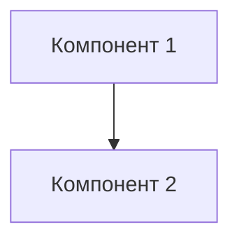

# Версии архитектуры системы бенчарков

Эта директория содержит снимки архитектуры системы бенчарков на разные даты.

## Назначение

- Отслеживать изменения в архитектуре
- Документировать принятие решений
- Позволять сравнивать разные версии

## Правила ведения

### Именование файлов

Формат: `YYYY-MM-DD_Description.md`

Примеры:
- `2026-02-13_Initial_Audit.md` - Начальный аудит архитектуры
- `2026-02-14_Add_Vector_DB.md` - Добавление векторной БД
- `2026-03-01_Refactor_Tiers.md` - Рефакторинг Tier 1 и Tier 2

### Структура файла

Каждый файл должен содержать:

1. **Заголовок**
   ```markdown
   # Архитектурный аудит: [краткое описание]
   
   ## Дата
   YYYY-MM-DD
   
   ## Обзор изменений
   ```

2. **Диаграммы**
   - Mermaid-диаграммы компонентов
   - Диаграммы потоков данных
   - ER-диаграммы при необходимости

3. **Описание изменений**
   - Какие компоненты изменены
   - Какие новые компоненты добавлены
   - Какие компоненты удалены

4. **Причины изменений**
   - Почему внесены изменения
   - Какую проблему решают
   - Какие альтернативы рассматривались

5. **Влияние на метрики**
   - Как изменения повлияли на метрики
   - Какие метрики улучшились/ухудшились
   - Результаты бенчарков до и после

6. **Риски и ограничения**
   - Какие риски вносит изменение
   - Какие ограничения накладывает
   - Как можно смягчить риски

## Пример шаблона

```markdown
# Архитектурный аудит: [Краткое описание]

## Дата
YYYY-MM-DD

## Обзор изменений

[Описание высокоуровневых изменений]

## Диаграммы



## Подробности изменений

### Добавлено
- [Новый компонент 1]
- [Новый компонент 2]

### Изменено
- [Компонент 1: что изменено]
- [Компонент 2: что изменено]

### Удалено
- [Удалённый компонент]

## Причины изменений

1. [Причина 1]
2. [Причина 2]

## Влияние на метрики

| Метрика | До | После | Изменение |
|---------|-----|-------|-----------|
| MRR | 0.75 | 0.86 | +0.11 ✅ |
| Recall@1 | 70% | 84% | +14% ✅ |

## Риски и ограничения

- [Риск 1]
- [Риск 2]

## Рекомендации по развитию

- [Рекомендация 1]
- [Рекомендация 2]
```

## Просмотр версий

Для просмотра хронологии изменения архитектуры:

```bash
ls -lt architecture_snapshots/
```

Для сравнения двух версий:

```bash
diff architecture_snapshots/2026-02-13_Initial_Audit.md \
      architecture_snapshots/2026-02-14_Add_Vector_DB.md
```

## Полезные ссылки

- [Текущая архитектура](2026-02-13_Architecture_Audit.md)
- [README бенчарков](../README.md)
- [Анализ структуры](../../../2026_benchmarks/01_Изоляция_проектных_файлов_в_директорию_бенчарков.md)
