# Архитектура модуля бенчмарков RAG-системы

Подробное описание архитектуры модуля бенчмарков Вопрошалыч.

---

## Диаграмма пайплайна

```mermaid
sequenceDiagram
    autonumber
    participant User as Пользователь
    participant CLI as CLI скрипты
    participant Generator as EmbeddingGenerator
    participant Judge as LLMJudge
    participant RAGBenchmark as RAGBenchmark
    participant RealBenchmark as RealQueriesBenchmark
    participant QA as qa.main
    participant DB as PostgreSQL
    participant FS as Файловая система
    participant Dashboard as Dashboard

    Note over User,Dashboard: Фаза 1: Генерация эмбеддингов

    User->>CLI: generate_embeddings.py --chunks
    CLI->>Generator: generate_for_chunks
    Generator->>DB: SELECT Chunk WHERE embedding IS NULL
    DB-->>Generator: chunks without embeddings
    loop Для каждого чанка
        Generator->>Generator: encoder.encode(chunk.text)
        Generator->>DB: UPDATE Chunk SET embedding
    end
    Generator-->>CLI: stats
    CLI-->>User: Статистика генерации

    Note over User,Dashboard: Фаза 2: Генерация датасета

    Note over User,Dashboard: Режим Synthetic
    User->>CLI: generate_dataset.py --mode synthetic --max-questions N
    CLI->>DB: SELECT Chunk WHERE embedding IS NOT NULL
    DB-->>CLI: chunks with embeddings
    loop Для каждого чанка до N вопросов
        CLI->>Judge: generate_question_from_chunk(chunk.text)
        Judge-->>CLI: question, ground_truth_answer
        CLI->>CLI: dataset.append(item)
    end
    CLI->>FS: Сохранить dataset_synthetic_*.json
    CLI-->>User: Путь к датасету

    Note over User,Dashboard: Режим Real Questions
    User->>CLI: generate_dataset.py --mode from-real-questions --max-questions N
    CLI->>DB: SELECT QuestionAnswer WHERE embedding IS NOT NULL
    DB-->>CLI: real questions
    loop Для каждого вопроса
        CLI->>CLI: encoder.encode(question)
        CLI->>DB: SELECT Chunk ORDER BY cosine_distance LIMIT 5
        DB-->>CLI: top-5 chunks
        CLI->>CLI: is_relevant_chunk_matched = match(pageId)
        CLI->>CLI: dataset.append(item)
    end
    CLI->>FS: Сохранить dataset_realq_*.json

    Note over User,Dashboard: Режим Score 5
    User->>CLI: generate_dataset.py --mode from-real-questions-score-5 --max-questions N
    CLI->>DB: SELECT QuestionAnswer WHERE score=5 AND embedding IS NOT NULL
    DB-->>CLI: real questions with score=5
    loop Для каждого вопроса
        CLI->>CLI: encoder.encode(question)
        CLI->>DB: SELECT Chunk ORDER BY cosine_distance LIMIT 5
        DB-->>CLI: top-5 chunks
        CLI->>CLI: dataset.append(item)
    end
    CLI->>FS: Сохранить dataset_realq5_*.json

    Note over User,Dashboard: Режим Manual (ручная аннотация)
    User->>CLI: generate_dataset.py --mode export-annotation --output dataset.json
    CLI->>FS: Читает существующий датасет
    FS-->>CLI: dataset
    CLI->>CLI: Добавляет поля для аннотации
    CLI->>FS: Сохраняет annotation_*.json
    User->>CLI: Проверяет/редактирует поля вручную
    User->>CLI: Помечает: is_question_ok, is_answer_ok, is_chunk_ok, notes

    Note over User,Dashboard: Фаза 3: Запуск бенчмарков

    Note over User,Dashboard: Tier 0: Embedding Quality
    User->>CLI: run_comprehensive_benchmark.py --tier 0 --mode synthetic
    CLI->>CLI: load_dataset(dataset_path)
    CLI->>RAGBenchmark: run_tier_0(dataset)
    loop Для каждого текста в датасете
        RAGBenchmark->>RAGBenchmark: encoder.encode(text)
        RAGBenchmark->>RAGBenchmark: compute NN/pairwise/spread metrics
        RAGBenchmark->>RAGBenchmark: compute effective_dimensionality
    end
    RAGBenchmark-->>CLI: tier_0_metrics
    CLI->>FS: save to benchmark_runs.json

    Note over User,Dashboard: Tier 1: Retrieval Accuracy
    User->>CLI: run_comprehensive_benchmark.py --tier 1 --mode synthetic
    CLI->>CLI: load_dataset(dataset_path)
    CLI->>RAGBenchmark: run_tier_1(dataset, top_k)
    loop Для каждого вопроса в датасете
        RAGBenchmark->>RAGBenchmark: encoder.encode(question)
        RAGBenchmark->>DB: SELECT Chunk ORDER BY cosine_distance LIMIT top_k
        DB-->>RAGBenchmark: top_k chunks
        RAGBenchmark->>RAGBenchmark: compute hit_rate, mrr, ndcg
    end
    RAGBenchmark-->>CLI: tier_1_metrics
    CLI->>FS: save to benchmark_runs.json

    Note over User,Dashboard: Tier 2: Generation Quality
    User->>CLI: run_comprehensive_benchmark.py --tier 2 --mode synthetic
    CLI->>RAGBenchmark: run_tier_2(dataset)
    loop Для каждого вопроса в датасете
        RAGBenchmark->>RAGBenchmark: resolve_context(item)
        RAGBenchmark->>QA: get_answer(question, context)
        QA-->>RAGBenchmark: system_answer
        RAGBenchmark->>Judge: evaluate_faithfulness(question, context, answer)
        Judge-->>RAGBenchmark: faithfulness_score
        RAGBenchmark->>Judge: evaluate_answer_relevance(question, answer)
        Judge-->>RAGBenchmark: relevance_score
        RAGBenchmark->>Judge: evaluate_answer_correctness(question, answer, ground_truth)
        Judge-->>RAGBenchmark: correctness_score
        RAGBenchmark->>RAGBenchmark: response consistency (N repeats)
        RAGBenchmark->>RAGBenchmark: compute rouge, bleu
    end
    RAGBenchmark-->>CLI: tier_2_metrics
    CLI->>FS: save to benchmark_runs.json

    Note over User,Dashboard: Tier 3: End-to-End
    User->>CLI: run_comprehensive_benchmark.py --tier 3 --mode synthetic
    CLI->>RAGBenchmark: run_tier_3(dataset)
    loop Для каждого вопроса в датасете
        RAGBenchmark->>RAGBenchmark: encoder.encode(question)
        RAGBenchmark->>DB: SELECT Chunk ORDER BY cosine_distance LIMIT 1
        DB-->>RAGBenchmark: retrieved_chunk
        RAGBenchmark->>QA: get_answer(question, chunk.text)
        QA-->>RAGBenchmark: system_answer
        RAGBenchmark->>Judge: evaluate_e2e_quality(question, system_answer, ground_truth)
        Judge-->>RAGBenchmark: e2e_score
        RAGBenchmark->>RAGBenchmark: cosine_similarity(system_answer, ground_truth)
        RAGBenchmark->>RAGBenchmark: dot_similarity + euclidean_distance
        RAGBenchmark->>RAGBenchmark: response consistency (N repeats)
        RAGBenchmark->>RAGBenchmark: compute rouge, bleu
    end
    RAGBenchmark-->>CLI: tier_3_metrics
    CLI->>FS: save to benchmark_runs.json

    Note over User,Dashboard: Tier Judge: LLM-as-a-Judge Quality
    User->>CLI: run_comprehensive_benchmark.py --tier judge --mode synthetic
    CLI->>RAGBenchmark: run_tier_judge(dataset)
    loop Для каждого примера
        RAGBenchmark->>Judge: evaluate_faithfulness() [1st call]
        Judge-->>RAGBenchmark: score_1
        RAGBenchmark->>Judge: evaluate_faithfulness() [2nd call]
        Judge-->>RAGBenchmark: score_2
        RAGBenchmark->>RAGBenchmark: compute consistency_score
        RAGBenchmark->>RAGBenchmark: measure latency
    end
    RAGBenchmark-->>CLI: tier_judge_metrics
    CLI->>FS: save to benchmark_runs.json

    Note over User,Dashboard: Tier Judge Pipeline: Production Judge
    User->>CLI: run_comprehensive_benchmark.py --tier judge_pipeline --mode synthetic
    CLI->>CLI: load_dataset(dataset_judge_pipeline_*.json)
    CLI->>RAGBenchmark: run_tier_judge_pipeline(judge_dataset)
    loop Для каждой пары (question, answer, ground_truth_show)
        RAGBenchmark->>QA: Config.get_judge_prompt(), get_judge_headers()
        QA-->>RAGBenchmark: prompt, headers
        RAGBenchmark->>RAGBenchmark: call Mistral API (JUDGE_MODEL)
        RAGBenchmark->>RAGBenchmark: parse "Yes"/"No"
        RAGBenchmark->>RAGBenchmark: compare with ground_truth_show
        RAGBenchmark->>RAGBenchmark: compute accuracy, precision, recall, f1
    end
    RAGBenchmark-->>CLI: tier_judge_pipeline_metrics
    CLI->>FS: save to benchmark_runs.json

    Note over User,Dashboard: Tier UX: User Experience
    User->>CLI: run_comprehensive_benchmark.py --tier ux --mode synthetic
    CLI->>RAGBenchmark: run_tier_ux(dataset)
    loop Для каждого вопроса
        RAGBenchmark->>RAGBenchmark: encoder.encode(question)
        RAGBenchmark->>DB: SELECT QuestionAnswer WHERE score=5
        DB-->>RAGBenchmark: high_score_questions
        RAGBenchmark->>RAGBenchmark: find similar in cache (cosine > 0.85)
        RAGBenchmark->>RAGBenchmark: compute cache_hit_rate
        RAGBenchmark->>RAGBenchmark: compute context_preservation
    end
    RAGBenchmark-->>CLI: tier_ux_metrics
    CLI->>FS: save to benchmark_runs.json

    Note over User,Dashboard: Real-users Benchmark
    User->>CLI: run_comprehensive_benchmark.py --mode real-users --real-score 5
    CLI->>RealBenchmark: run(top_k, score_filter, limit)
    RealBenchmark->>DB: SELECT QuestionAnswer WHERE score=5 AND embedding IS NOT NULL
    DB-->>RealBenchmark: real_questions
    loop Для каждого реального вопроса
        RealBenchmark->>RealBenchmark: encoder.encode(question)
        RealBenchmark->>DB: SELECT Chunk ORDER BY cosine_distance LIMIT top_k
        DB-->>RealBenchmark: retrieved_chunks
        RealBenchmark->>RealBenchmark: compare with QuestionAnswer.confluence_url
        RealBenchmark->>RealBenchmark: compute recall, precision, mrr, ndcg
    end
    RealBenchmark-->>CLI: real_user_metrics
    CLI->>FS: save to benchmark_runs.json

    Note over User,Dashboard: Source Analytics
    User->>CLI: --analyze-utilization / --analyze-topics / --analyze-domain
    CLI->>CLI: analyze_chunk_utilization()
    CLI->>CLI: analyze_topic_coverage()
    CLI->>CLI: analyze_real_users_domain()
    CLI->>FS: save utilization/topic/domain metrics

    Note over User,Dashboard: Multi-model sweep
    User->>CLI: --judge-models --generation-models
    CLI->>CLI: iterate model combinations
    CLI->>FS: save model_runs[] in benchmark_runs.json

    Note over User,Dashboard: Запуск всех tiers (--tier all)
    User->>CLI: run_comprehensive_benchmark.py --tier all --mode synthetic
    CLI->>RAGBenchmark: run_tier_0(dataset)
    CLI->>RAGBenchmark: run_tier_1(dataset, top_k)
    CLI->>RAGBenchmark: run_tier_2(dataset)
    CLI->>RAGBenchmark: run_tier_3(dataset)
    CLI->>RAGBenchmark: run_tier_judge(dataset)
    CLI->>RAGBenchmark: run_tier_judge_pipeline(judge_dataset)
    CLI->>RAGBenchmark: run_tier_ux(dataset)
    CLI->>FS: save all metrics to benchmark_runs.json

    Note over User,Dashboard: Фаза 4: Просмотр результатов

    User->>CLI: run_dashboard.py
    CLI->>Dashboard: main
    Dashboard->>FS: read benchmark_runs.json
    FS-->>Dashboard: all_runs
    Dashboard->>Dashboard: create_interface
    Dashboard-->>User: Gradio UI на http://localhost:7860
```



---

## Описание шагов пайплайна

### Фаза 1: Генерация эмбеддингов

**Шаг 1-2:** Пользователь запускает `generate_embeddings.py --chunks`. CLI создаёт экземпляр `EmbeddingGenerator`.

**Шаг 3:** `EmbeddingGenerator` запрашивает из БД все чанки без эмбеддингов.

**Шаг 4-6:** Для каждого чанка генерируется эмбеддинг через `SentenceTransformer` и сохраняется в БД.

**Шаг 7-8:** Возвращается статистика: total, processed, skipped, errors.

**Реализация:** `benchmarks/utils/embedding_generator.py`, метод `generate_for_chunks()`.

---

### Фаза 2: Генерация датасета

Система поддерживает 4 режима генерации датасета. Каждый режим создаёт JSON-файл в `benchmarks/data/`.

#### Режим Synthetic

**Команда:** `generate_dataset.py --mode synthetic --max-questions N`

**Процесс:**
1. CLI запрашивает чанки с эмбеддингами из БД
2. Для каждого чанка (до N) вызывается `LLMJudge.generate_question_from_chunk()`
3. LLM генерирует вопрос и эталонный ответ на основе текста чанка
4. Датасет сохраняется в `dataset_synthetic_YYYYMMDD_HHMMSS.json`

**Структура:**
```json
{
  "id": "uuid",
  "question": "Как настроить VPN?",
  "ground_truth_answer": "Для настройки VPN...",
  "chunk_id": 123,
  "chunk_text": "Текст чанка...",
  "confluence_url": "https://...",
  "relevant_chunk_ids": [123, 456],
  "source": "synthetic",
  "question_source": "llm"
}
```

#### Режим Real Questions

**Команда:** `generate_dataset.py --mode from-real-questions --max-questions N`

**Процесс:**
1. CLI запрашивает вопросы из `QuestionAnswer` с эмбеддингами
2. Для каждого вопроса выполняется similarity search (top-5 чанков)
3. Вычисляется `is_relevant_chunk_matched` — совпадение pageId из URL
4. Сохраняется в `dataset_realq_YYYYMMDD_HHMMSS.json`

**Особенности:**
- Ground truth answer: `QuestionAnswer.answer`
- Сохраняется: `user_score`, `question_answer_id`, `is_relevant_chunk_matched`

#### Режим Score 5

**Команда:** `generate_dataset.py --mode from-real-questions-score-5 --max-questions N`

Аналогично Real Questions, но фильтр по `score = 5` (наиболее удовлетворённые пользователи).

#### Режим Manual (ручная аннотация)

**Команда:** `generate_dataset.py --mode export-annotation --output dataset.json`

**Процесс:**
1. CLI читает существующий датасет
2. Добавляет поля для ручной проверки:
   - `is_question_ok` — вопрос корректен
   - `is_answer_ok` — ответ корректен
   - `is_chunk_ok` — чанок релевантен
   - `is_confluence_url_ok` — URL корректен
   - `notes` — примечания
3. Сохраняет в `annotation_YYYYMMDD_HHMMSS.json`
4. Пользователь вручную проверяет и редактирует поля

**Реализация:** `benchmarks/generate_dataset.py`, функции `generate_synthetic_dataset()`, `generate_from_real_questions()`, `export_for_annotation()`.

---

### Фаза 3: Запуск бенчмарков

Система поддерживает запуск отдельных tiers или всех сразу (`--tier all`).

#### Запуск всех tiers

**Команда:** `run_comprehensive_benchmark.py --tier all --mode synthetic`

Последовательно выполняет все tiers и сохраняет все метрики в `benchmark_runs.json`.

---

#### Tier 0: Embedding Quality (качество эмбеддингов)

**Команда:** `--tier 0`

**Процесс:**
1. Извлекаются тексты из датасета (без требований к cluster_id/label)
2. Вычисляются эмбеддинги для каждого текста
3. Рассчитываются intrinsic-метрики: NN distance, spread, pairwise distance

**Метрики:** avg_nn_distance, density_score, avg_spread,
effective_dimensionality, avg_pairwise_distance и др.

**Реализация:** `benchmarks/models/rag_benchmark.py`, метод `run_tier_0()`.

---

#### Tier 1: Retrieval Accuracy (точность поиска)

**Команда:** `--tier 1`

**Процесс:**
1. Для каждого вопроса генерируется эмбеддинг
2. Выполняется векторный поиск через `Chunk.embedding.cosine_distance()` top-k
3. При `consistency_runs > 1` проверяется стабильность top-k выдачи
4. Сравниваются retrieved chunk_id с ground truth
5. Вычисляются: HitRate@K, MRR, NDCG@K, Recall@K, Precision@K

**Метрики:** hit_rate@1/5/10, mrr, recall@1/3/5/10,
precision@1/3/5/10, ndcg@5/10, retrieval_consistency

**Реализация:** `benchmarks/models/rag_benchmark.py`, метод `run_tier_1()`.

---

#### Tier 2: Generation Quality (качество генерации)

**Команда:** `--tier 2`

**Процесс:**
1. Контекст берётся из датасета (`chunk_text`, `relevant_chunk_ids`, или `chunk_id`)
2. Вызывается `qa.main.get_answer()` для генерации ответа (Mistral)
3. LLMJudge оценивает faithfulness и answer_relevance
4. LLMJudge оценивает answer_correctness по эталону
5. При `consistency_runs > 1` считаются consistency-метрики ответа
6. Вычисляются алгоритмические метрики: ROUGE-1/2/L, BLEU

**Метрики:** avg_faithfulness, avg_answer_relevance, avg_answer_correctness,
response_exact_match_rate, response_semantic_consistency,
avg_rouge1_f, avg_rouge2_f, avg_rougeL_f, avg_bleu

**Реализация:** `benchmarks/models/rag_benchmark.py`, метод `run_tier_2()`, использует импорт `get_answer` из `qa.main`.

---

#### Tier 3: End-to-End (сквозной)

**Команда:** `--tier 3`

**Процесс:**
1. Retrieval выполняется через production код (`qa.confluence_retrieving.get_chunk()`)
2. Генерируется ответ через `qa.main.get_answer()`
3. LLMJudge оценивает E2E качество
4. Вычисляются cosine/dot/euclidean similarity с ground truth
5. При `consistency_runs > 1` считаются consistency-метрики ответа
6. Вычисляются алгоритмические метрики: ROUGE, BLEU

**Метрики:** avg_e2e_score, avg_semantic_similarity, avg_dot_similarity,
avg_euclidean_distance, response_exact_match_rate,
response_semantic_consistency, avg_rouge1_f, avg_rouge2_f,
avg_rougeL_f, avg_bleu

**Важно:** Tier 3 точно воспроизводит production пайпайн (1 чанк, top-1).

**Реализация:** `benchmarks/models/rag_benchmark.py`, метод `run_tier_3()`, использует импорт `get_chunk` из `qa.confluence_retrieving`.

---

#### Tier Judge: LLM-as-a-Judge Quality (качество LLM-судьи)

**Команда:** `--tier judge`

**Процесс:**
1. Используется `LLMJudge` из `benchmarks.utils.llm_judge`
2. Для каждого примера вызывается `judge.evaluate_faithfulness()` первый раз
3. При включённой проверке консистентности — повторный вызов
4. Сравниваются оценки для вычисления consistency_score
5. Замеряется latency каждого вызова

**Метрики:** consistency_score, error_rate, avg_latency_ms, avg_faithfulness

**Отличие от Tier Judge Pipeline:**
- Tier Judge тестирует benchmark judge конфигурацию (может быть multi-model)
- Tier Judge Pipeline тестирует production judge решение show/no-show

**Реализация:** `benchmarks/models/rag_benchmark.py`, метод `run_tier_judge()`.

---

#### Tier Judge Pipeline: Production Judge (качество production судьи)

**Команда:** `--tier judge_pipeline`

**Процесс:**
1. Загружается датасет `dataset_judge_pipeline_*.json` с парами (question, answer, ground_truth_show)
2. Для каждой пары вызывается production judge через `qa.config.Config.get_judge_prompt()` и `Config.get_judge_headers()`
3. Mistral (JUDGE_MODEL) возвращает "Yes"/"No"
4. Сравнивается решение судьи с ground_truth_show
5. Вычисляются: accuracy, precision, recall, F1

**Метрики:** accuracy, precision, recall, f1_score, avg_latency_ms, TP/FP/FN/TN

**Реализация:** `benchmarks/models/rag_benchmark.py`, метод `run_tier_judge_pipeline()`.

---

#### Tier UX: User Experience (пользовательский опыт)

**Команда:** `--tier ux`

**Процесс:**
1. Загружаются вопросы с `score=5` из `QuestionAnswer`
2. Для каждого вопроса ищется семантически схожий вопрос в кэше (similarity > 0.85)
3. Вычисляется cache_hit_rate
4. Для многотуровых сессий вычисляется context_preservation

**Метрики:** cache_hit_rate, context_preservation, multi_turn_consistency

**Реализация:** `benchmarks/models/rag_benchmark.py`, метод `run_tier_ux()`.

---

#### Real-users Benchmark (бенчмарк на реальных пользователях)

**Команда:** `--mode real-users --real-score 5 --real-limit N --top-k K`

**Процесс:**
1. Загружаются вопросы из `QuestionAnswer` с фильтром score (обычно 5)
2. Для каждого вопроса генерируется эмбеддинг
3. Выполняется retrieval top-k
4. Retrieved URLs сравниваются с `QuestionAnswer.confluence_url` (ground truth)
5. Вычисляются: HitRate, MRR, NDCG, Recall, Precision

**Метрики:** hit_rate@1/5/10, mrr, recall@K, precision@K, ndcg@5/10

**Ground truth:** `QuestionAnswer.confluence_url` — URL документа, показанного пользователю в production

**Реализация:** `benchmarks/models/real_queries_benchmark.py`, метод `run()`.

---

### Фаза 4: Просмотр результатов

**Команда:** `run_dashboard.py`

**Процесс:**
1. Dashboard загружает все запуски из `benchmark_runs.json`
2. Создаётся Gradio интерфейс с графиками и таблицами
3. Доступен по адресу: http://localhost:7860

**Реализация:** `benchmarks/dashboard.py`, класс `RAGBenchmarkDashboard`.

---

## Компоненты системы

### RAG-модуль (qa/)

| Файл | Назначение |
|------|------------|
| `qa/main.py` | Генерация ответов через Mistral API |
| `qa/config.py` | Конфигурация, промпты, переменные окружения |
| `qa/database.py` | Модели SQLAlchemy (Chunk, QuestionAnswer) |

### Benchmark-модуль (benchmarks/)

| Файл | Назначение |
|------|------------|
| `run_comprehensive_benchmark.py` | CLI для запуска бенчмарков |
| `generate_dataset.py` | Генерация synthetic датасета |
| `generate_embeddings.py` | Генерация эмбеддингов |
| `visualize_vector_space.py` | UMAP-визуализация векторного пространства |
| `analyze_chunk_utilization.py` | Анализ доли используемых чанков |
| `analyze_topic_coverage.py` | Анализ покрытия тематических кластеров |
| `analyze_real_users_domain.py` | Анализ real-user предметной области |
| `run_dashboard.py` | Запуск дашборда |
| `dashboard.py` | Gradio дашборд |
| `models/rag_benchmark.py` | Tier 0/1/2/3/Judge/UX бенчмарки |
| `models/real_queries_benchmark.py` | Real-users benchmark |
| `utils/llm_judge.py` | LLM-судья для оценки качества |
| `utils/evaluator.py` | Метрики: HitRate, MRR, NDCG |
| `utils/text_metrics.py` | Алгоритмические метрики: ROUGE, BLEU, BERTScore |
| `utils/embedding_generator.py` | Генерация эмбеддингов |

---

## Таблицы базы данных

### chunk

| Поле | Тип | Описание |
|------|-----|----------|
| id | int | PK |
| confluence_url | text | URL источника |
| text | text | Текст чанка |
| embedding | vector(1024) | Векторное представление |

### question_answer

| Поле | Тип | Описание |
|------|-----|----------|
| id | int | PK |
| question | text | Вопрос пользователя |
| answer | text | Ответ системы |
| confluence_url | text | URL источника |
| score | int | Оценка пользователя (1-5) |
| embedding | vector(1024) | Вектор вопроса |
| user_id | int | FK -> user.id |

### benchmark_runs.json

Файл: `benchmarks/reports/benchmark_runs.json`

Структура (JSON array):

| Поле | Тип | Описание |
|------|-----|----------|
| id | string | ID запуска (timestamp) |
| timestamp | datetime | Время запуска |
| git_branch | text | Ветка git |
| git_commit_hash | text | Hash коммита |
| run_author | text | Автор запуска |
| schema_version | text | Версия схемы метрик (для совместимости) |
| dataset_file | text | Имя файла датасета |
| dataset_type | text | synthetic/manual/real-users |
| judge_model | text | Модель для судейства (Qwen) |
| generation_model | text | Модель для генерации (Mistral) |
| embedding_model | text | Модель эмбеддингов |
| judge_eval_mode | text | Режим судьи: direct/reasoned |
| consistency_runs | int | Количество повторов для consistency |
| tier_0_metrics | json | Метрики Tier 0 (Embedding Quality) |
| tier_1_metrics | json | Метрики Tier 1 (Retrieval) |
| tier_2_metrics | json | Метрики Tier 2 (Generation) |
| tier_3_metrics | json | Метрики Tier 3 (End-to-End) |
| tier_judge_metrics | json | Метрики Tier Judge (LLM Quality, Qwen) |
| tier_judge_pipeline_metrics | json | Метрики Tier Judge Pipeline (Production Judge, Mistral) |
| tier_ux_metrics | json | Метрики Tier UX (User Experience) |
| real_user_metrics | json | Метрики real-users |
| utilization_metrics | json | Метрики использования чанков |
| topic_coverage_metrics | json | Метрики покрытия тем |
| domain_analysis_metrics | json | Метрики анализа real-user домена |
| model_runs | json | Результаты multi-model комбинаций |
| executive_summary | text | Сводка запуска для дашборда |
| overall_status | text | Итоговый статус |

**schema_version:** Поле для обеспечения совместимости при изменении архитектуры. Текущая версия: `2.0`. При изменении структуры метрик — увеличивать версию.

---

## Связанные документы

- [METRICS.md](METRICS.md) — Полное научное описание всех метрик с формулами и обоснованием
- [SMOKE_SCENARIO_LOCAL.md](SMOKE_SCENARIO_LOCAL.md) — Полный цикл проверки
- [CLI_REFERENCE.md](CLI_REFERENCE.md) — Справочник по CLI командам
