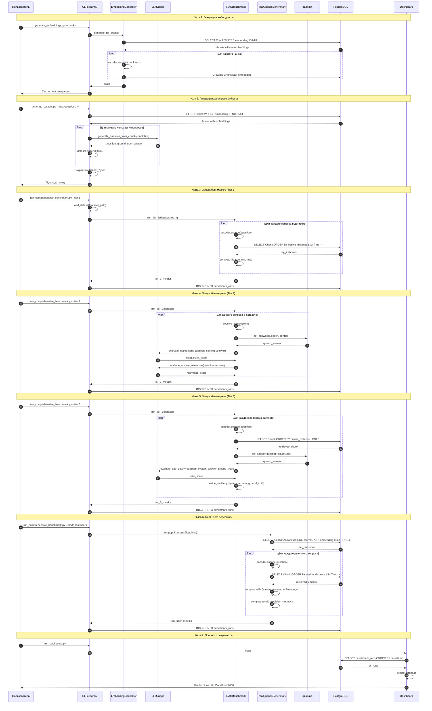

# Архитектура модуля бенчмарков RAG-системы

Подробное описание архитектуры модуля бенчмарков Вопрошалыч.

---

## Диаграмма пайплайна

---

## Описание шагов пайплайна

### Фаза 1: Генерация эмбеддингов

**Шаг 1-2:** Пользователь запускает `generate_embeddings.py --chunks`. CLI создаёт экземпляр `EmbeddingGenerator`.

**Шаг 3:** `EmbeddingGenerator` запрашивает из БД все чанки без эмбеддингов.

**Шаг 4-6:** Для каждого чанка генерируется эмбеддинг через `SentenceTransformer` и сохраняется в БД.

**Шаг 7-8:** Возвращается статистика: total, processed, skipped, errors.

**Реализация:** `benchmarks/utils/embedding_generator.py`, метод `generate_for_chunks()`.

---

### Фаза 2: Генерация датасета (synthetic)

**Шаг 9-10:** Пользователь запускает `generate_dataset.py --max-questions N`. CLI запрашивает чанки с эмбеддингами.

**Шаг 11-14:** Для каждого чанка (до достижения N) вызывается `LLMJudge.generate_question_from_chunk()`, который генерирует вопрос и идеальный ответ на основе текста чанка.

**Шаг 15-16:** Датасет сохраняется в файл `benchmarks/data/dataset_YYYYMMDD_HHMMSS.json`.

**Реализация:** `benchmarks/generate_dataset.py`, функция `generate_synthetic_dataset()`.

---

### Фаза 3: Запуск бенчмарков (Tier 1)

**Шаг 17-19:** Пользователь запускает `run_comprehensive_benchmark.py --tier 1`. Загружается датасет и создаётся `RAGBenchmark`.

**Шаг 20-23:** Для каждого вопроса:
- Генерируется эмбеддинг вопроса
- Выполняется векторный поиск через `Chunk.embedding.cosine_distance()`
- Вычисляются метрики: HitRate@K, MRR, NDCG@K

**Шаг 24-25:** Результаты сохраняются в `benchmark_runs` таблицу.

**Реализация:** `benchmarks/models/rag_benchmark.py`, метод `run_tier_1()`.

---

### Фаза 4: Запуск бенчмарков (Tier 2)

**Шаг 26-28:** Пользователь запускает `run_comprehensive_benchmark.py --tier 2`. Создаётся `RAGBenchmark`.

**Шаг 29-33:** Для каждого вопроса:
- Определяется контекст из датасета (`chunk_text`, `relevant_chunk_ids`, или `chunk_id`)
- Вызывается `qa.main.get_answer()` для генерации ответа
- `LLMJudge` оценивает faithfulness (фактичность) и answer_relevance (релевантность)

**Шаг 34-35:** Результаты сохраняются.

**Реализация:** `benchmarks/models/rag_benchmark.py`, метод `run_tier_2()`.

---

### Фаза 5: Запуск бенчмарков (Tier 3)

**Шаг 36-38:** Пользователь запускает `run_comprehensive_benchmark.py --tier 3`.

**Шаг 39-44:** Для каждого вопроса:
- Генерируется эмбеддинг вопроса
- Выполняется retrieval top-1
- Генерируется ответ через `qa.main.get_answer()`
- `LLMJudge` оценивает E2E качество
- Вычисляется cosine similarity между системным и эталонным ответом

**Шаг 45-46:** Результаты сохраняются.

**Реализация:** `benchmarks/models/rag_benchmark.py`, метод `run_tier_3()`.

---

### Фаза 6: Real-users benchmark

**Шаг 47-49:** Пользователь запускает `run_comprehensive_benchmark.py --mode real-users`. Создаётся `RealQueriesBenchmark`.

**Шаг 50-54:** Для каждого реального вопроса из `QuestionAnswer` с `score=5`:
- Генерируется эмбеддинг вопроса
- Выполняется retrieval top-k
- Retrieved URL сравниваются с `QuestionAnswer.confluence_url`
- Вычисляются retrieval-метрики

**Шаг 55-56:** Результаты сохраняются.

**Реализация:** `benchmarks/models/real_queries_benchmark.py`, метод `run()`.

---

### Фаза 7: Просмотр результатов

**Шаг 57-60:** Пользователь запускает `run_dashboard.py`. Dashboard загружает все запуски из `benchmark_runs` и создаёт Gradio интерфейс.

**Реализация:** `benchmarks/dashboard.py`, класс `RAGBenchmarkDashboard`.

---

## Компоненты системы

### RAG-модуль (qa/)

| Файл | Назначение |
|------|------------|
| `qa/main.py` | Генерация ответов через Mistral API |
| `qa/config.py` | Конфигурация, промпты, переменные окружения |
| `qa/database.py` | Модели SQLAlchemy (Chunk, QuestionAnswer, BenchmarkRun) |

### Benchmark-модуль (benchmarks/)

| Файл | Назначение |
|------|------------|
| `run_comprehensive_benchmark.py` | CLI для запуска бенчмарков |
| `generate_dataset.py` | Генерация synthetic датасета |
| `generate_embeddings.py` | Генерация эмбеддингов |
| `run_dashboard.py` | Запуск дашборда |
| `dashboard.py` | Gradio дашборд |
| `models/rag_benchmark.py` | Tier 1/2/3 бенчмарки |
| `models/real_queries_benchmark.py` | Real-users benchmark |
| `utils/llm_judge.py` | LLM-судья для оценки качества |
| `utils/evaluator.py` | Метрики: HitRate, MRR, NDCG |
| `utils/embedding_generator.py` | Генерация эмбеддингов |

---

## Таблицы базы данных

### chunk

| Поле | Тип | Описание |
|------|-----|----------|
| id | int | PK |
| confluence_url | text | URL источника |
| text | text | Текст чанка |
| embedding | vector(1024) | Векторное представление |

### question_answer

| Поле | Тип | Описание |
|------|-----|----------|
| id | int | PK |
| question | text | Вопрос пользователя |
| answer | text | Ответ системы |
| confluence_url | text | URL источника |
| score | int | Оценка пользователя (1-5) |
| embedding | vector(1024) | Вектор вопроса |
| user_id | int | FK -> user.id |

### benchmark_runs

| Поле | Тип | Описание |
|------|-----|----------|
| id | int | PK |
| timestamp | datetime | Время запуска |
| git_branch | text | Ветка git |
| git_commit_hash | text | Hash коммита |
| run_author | text | Автор запуска |
| dataset_file | text | Имя файла датасета |
| dataset_type | text | synthetic/manual/real-users |
| tier_1_metrics | json | Метрики Tier 1 |
| tier_2_metrics | json | Метрики Tier 2 |
| tier_3_metrics | json | Метрики Tier 3 |
| real_user_metrics | json | Метрики real-users |
| overall_status | text | Итоговый статус |

---

## Связанные документы

- [RUN_MODES_LOCAL_VS_DOCKER.md](RUN_MODES_LOCAL_VS_DOCKER.md) — режимы работы
- [CLI_REFERENCE.md](CLI_REFERENCE.md) — справочник по CLI командам
- [SMOKE_SCENARIO_LOCAL.md](SMOKE_SCENARIO_LOCAL.md) — инструкции для локального режима
- [SMOKE_SCENARIO_DOCKER.md](SMOKE_SCENARIO_DOCKER.md) — инструкции для Docker режима
